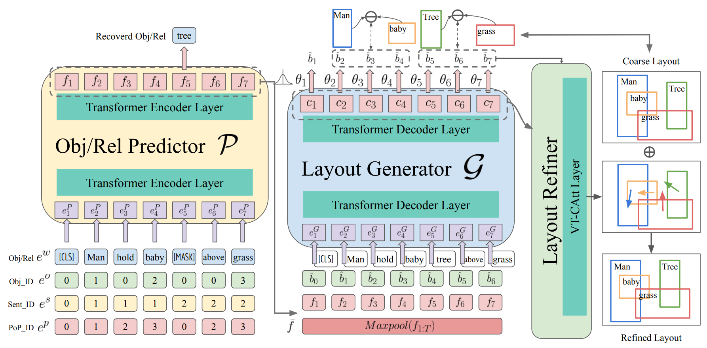

# [LayoutTransformer-Scene-Layout-Generation-with-Conceptual-and-Spatial-Diversity](https://openaccess.thecvf.com/content/CVPR2021/papers/Yang_LayoutTransformer_Scene_Layout_Generation_With_Conceptual_and_Spatial_Diversity_CVPR_2021_paper.pdf)
Cheng-Fu Yang*, Wan-Cyuan Fan*, Fu-En Yang, Yu-Chiang Frank Wang, "LayoutTransformer: Scene Layout Generation with Conceptual and Spatial Diversity", Proceedings of the IEEE/CVF Conference on Computer Vision and Pattern Recognition. 2021.

# LayoutTransformer 
Pytorch implementation for LT-Net. The goal is to generate scene layout with conceptual and spatial diversity.

### Overview


### UPdates
- The training code on the VG-msdn dataset might have some minor errors. We will fix them ASAP.

### Data
- Please setup conda envirnment first by following command.
    - Create conda env
```
conda create -n ltnet python=3.6
conda activate ltnet
```
    - Install pip packages
```
pip install -r requirements.txt 
```

### Data
- COCO dataset
    - Download the annotations from [COCO](https://cocodataset.org/#download).
    - i.e., 2017 Train/Val annotations [241MB] and 2017 Stuff Train/Val annotations [1.1GB]
    - Extract the annotations to `data/coco/`
- VG-MSDN dataset
    - Download the VG-MSDN dataset from [VG-MSDN](https://drive.google.com/file/d/1WjetLwwH3CptxACrXnc1NCcccWUVDO76/view). (This dataset origins from [FactorizableNet](https://github.com/yikang-li/FactorizableNet))
    - Extract the annotations (i.e., all json files) to `data/vg_msdn/`

### Training
All code was developed and tested on Ubuntu 20.04 with Python 3.7 (Anaconda) and PyTorch 1.7.1.

#### Pre-train the Obj/Rel Rredictor
- Pre-train Predictor module for COCO dataset:
```
python3 train.py --cfg_path ./configs/coco/coco_pretrain.yaml
```
- Pre-train Predictor model for VG-MSDN dataset: 
```
python3 train.py --cfg_path ./configs/vg_msdn/vg_msdn_pretrain.yaml
```
#### Full module
- Train full model for COCO dataset:
```
python3 train.py --cfg_path ./configs/coco/coco_seq2seq_v9_ablation_4.yaml
```
- Train full model for VG-MSDN dataset: 
```
python3 train.py --cfg_path ./configs/vg_msdn/vg_msdn_seq2seq_v24.yaml
```

`*.yml` files include configuration for training and testing.

> Please note that you might need to modify the config file to fit the corresponding path on your device if the data is placed in other places.

### Pretrained Model Weights
Google drive: [Download](https://drive.google.com/drive/folders/1pPJxX0ih6pgUpKjeIjIICso6SpOGHoaI?usp=sharing)
#### Obj/Rel Predictor 
- [COCO](https://drive.google.com/drive/folders/1I6Hfkdv58_mkT7JJhnIR5we3TTM_L-mN?usp=sharing). Download and save it to `saved/coco_F_pretrain_no_linear`
- [VG-MSDN](https://drive.google.com/drive/folders/1E3ZQgMEAr5yoIRzcQHmUltfLOnrgHVch?usp=sharing). Download and save it to `saved/vg_msdn_F_pretrain_no_linear`
#### LT-Net Full Model 
- [COCO](https://drive.google.com/drive/folders/1pDHGIob1nc480AysXgdAqO8BIBUaS9r-?usp=sharing). Download and save it to `saved/coco_F_seq2seq_v9_ablation_4`
- [VG-MSDN](https://drive.google.com/drive/folders/1F9J2t9QAHCdcSYZKI3lLkDJcVAQh2jpD?usp=sharing). Download and save it to `saved/vg_msdn_F_seq2seq_v24`

### Evaluation

#### LayoutTransformer full model   
- Evaluate full model for COCO dataset: (Please download or train your LayoutTransformer for COCO first.)
```
python3 train.py --cfg_path [PATH_TO_CONFIG_FILE] --checkpoint [PATH_TO_THE_WEIGHT_FOR_LAYOUTTRASFORMER] --eval_only
```
For example,
```
python3 train.py --cfg_path configs/coco/coco_seq2seq_v9_ablation_4.yaml --checkpoint ./saved/coco_F_seq2seq_v9_ablation_4/checkpoint_50_0.44139538748348955.pth --eval_only
```
- Evaluate full model for VG-MSDN dataset: (Please download or train your LayoutTransformer for vg-msdn first.)
```
python3 train.py --cfg_path [PATH_TO_CONFIG_FILE] --checkpoint [PATH_TO_THE_WEIGHT_FOR_LAYOUTTRASFORMER] --eval_only
```
For example,
```
python3 train.py --cfg_path configs/vg_msdn/vg_msdn_seq2seq_v24.yaml --checkpoint ./saved/vg_msdn_F_seq2seq_v24/checkpoint_50_0.16316922369277578.pth --eval_only
```
### Citation

If you find this useful for your research, please use the following.

```
@InProceedings{Yang_2021_CVPR,
    author    = {Yang, Cheng-Fu and Fan, Wan-Cyuan and Yang, Fu-En and Wang, Yu-Chiang Frank},
    title     = {LayoutTransformer: Scene Layout Generation With Conceptual and Spatial Diversity},
    booktitle = {Proceedings of the IEEE/CVF Conference on Computer Vision and Pattern Recognition (CVPR)},
    month     = {June},
    year      = {2021},
    pages     = {3732-3741}
}
```

### Acknowledgements
This code borrows heavily from [Transformer](https://github.com/pytorch/pytorch/blob/master/torch/nn/modules/transformer.py) repository. Many thanks.